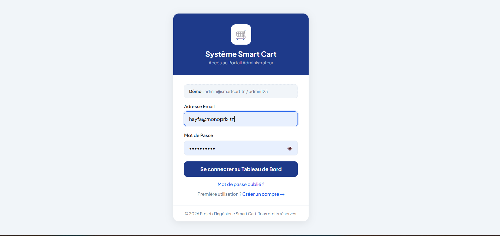
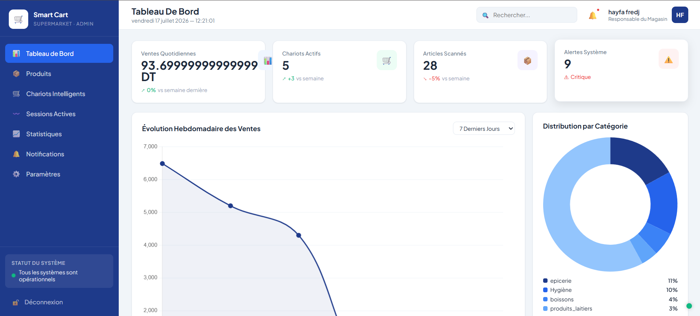
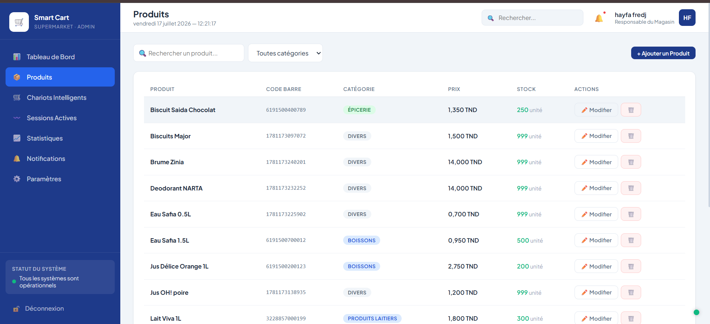
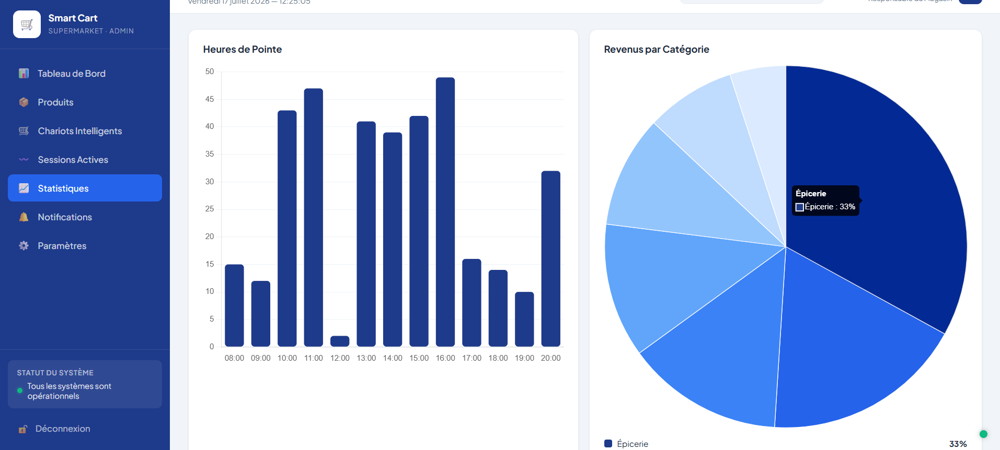
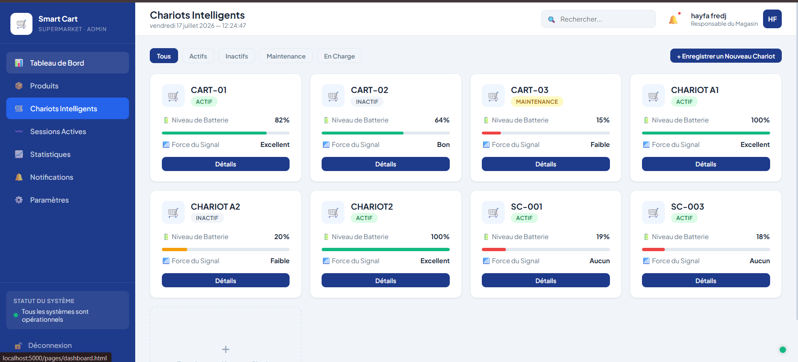

# 🛒 Smart Cart Supermarket — Dashboard Administrateur
**PFE — Système de Chariots Intelligents**

description:Smart Cart Dashboard est une interface d'administration développée dans le cadre d'un projet de fin d'études. Elle permet de gérer les chariots intelligents, les produits, les sessions d'achat, les notifications et les statistiques en temps réel.

## 🚀 Technologies

- Node.js
- Express.js
- MySQL
- HTML5
- CSS3
- JavaScript
- JWT Authentication
- Chart.js

---

## 📁 Structure du Projet

```
smartcart/
├── backend/
│   ├── config/
│   │   ├── db.js           → Connexion MySQL
│   │   └── database.sql    → Schéma + données démo
│   ├── middleware/
│   │   └── auth.js         → Authentification JWT
│   ├── routes/
│   │   ├── auth.js         → POST /api/auth/login
│   │   ├── dashboard.js    → GET  /api/dashboard/stats
│   │   ├── chariots.js     → CRUD /api/chariots
│   │   ├── sessions.js     → GET  /api/sessions
│   │   ├── produits.js     → CRUD /api/produits
│   │   ├── notifications.js→ GET  /api/notifications
│   │   └── statistiques.js → GET  /api/statistiques
│   ├── .env                → Variables d'environnement
│   ├── package.json
│   └── server.js           → Point d'entrée Express
│
└── frontend/
    ├── css/
    │   └── style.css       → Styles globaux
    ├── js/
    │   ├── api.js          → Helper API + utils
    │   └── layout.js       → Sidebar + topbar partagés
    └── pages/
        ├── login.html          → Page connexion
        ├── dashboard.html      → Tableau de bord
        ├── chariots.html       → Gestion chariots
        ├── sessions.html       → Sessions actives
        ├── statistiques.html   → Graphiques
        ├── produits.html       → Catalogue produits
        ├── notifications.html  → Historique alertes
        └── parametres.html     → Configuration
```

---

## ⚙️ Installation

### 1. Prérequis
- Node.js 18+
- MySQL 8.0+
- npm

### 2. Base de Données MySQL

Ouvrez MySQL et exécutez :
```sql
-- Dans MySQL Workbench ou CLI
source /chemin/vers/smartcart/backend/config/database.sql
```

### 3. Backend

```bash
npm install
```

Configurez `.env` si nécessaire :
```env
Configurez votre fichier `.env` selon votre environnement.

Démarrez le serveur :
```bash
npm run dev    # Mode développement (nodemon)
# ou
npm start      # Mode production
```

Le serveur sera disponible sur : http://localhost:5000

### 4. Frontend

Le frontend est servi directement par Express (fichiers statiques).
Ouvrez votre navigateur sur : **http://localhost:5000**

---

## 🔑 Accès Démo

Des comptes de démonstration peuvent être créés via la base de données fournie.

---

# 📷 Captures d'écran

## 🔐 Login



---

## 📊 Dashboard



---

## 🛒 Gestion des Produits



---

## 📈 Statistiques



---

## 🚗 Gestion des Chariots



*© 2026 Projet d'Ingénierie Smart Cart — PFE*
